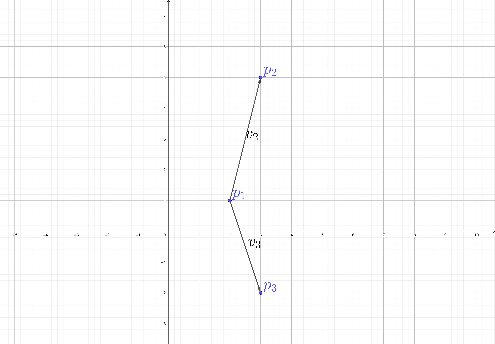
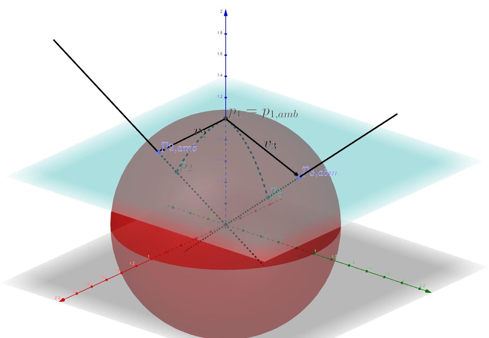

# [Introduction to geometry](@id geometry-intro)


## Meaning of manifolds

This library does not use any formal definition of a manifold. To put it another way, any such definition would have to be very complicated to encompass all supported spaces. As such, the definition would not be useful for any particular purpose.

The simplest case are finite-dimensional manifolds. You can read about them [here](https://en.wikipedia.org/wiki/Manifold). They locally look like a plain euclidean space, though their global shape may be more complicated. When thinking about manifolds, it is useful to imagine a sphere or a torus as these examples exhibit many key properties differentiating them from euclidean spaces.

Manifolds as discussed above do not have enough structure to perform operations that we want to do. This is the source of a joke that [a topologist can't tell the difference between a coffee mug and a donut](https://www.shapeways.com/forum/t/a-topologist-cant-tell-the-difference-between-a-coffee-mug-and-a-donut.27149/). The additional structure that allows us to distinguish these two objects is the [riemannian metric](https://en.wikipedia.org/wiki/Riemannian_manifold). A coffee mug and a donut are two possible embeddings of a torus in the three-dimensional euclidean space. Riemannian metric allows us to select a preferred (formally, isometric) embedding. Isometric embeddings are not unique but almost all features that will be interesting for us are invariant. After all, a donut moved to a different place represents a different embedding but it is clearly still a donut.

To understand what a riemannian metric does, imagine a euclidean space with two vectors (actually, displacement vectors) attached to a common point. You can easily calculate their inner product. A few more calculations will show you that the inner product does not depend on the choice of basis for the euclidean space. Now let us take this analogy to the case of a manifold. To do this, imagine that what vectors actually represent is a direction that a curve passing through a given point may take, that is a vector tangent to that curve. Once you do this for the euclidean space, it is easy to extend it to arbitrary manifolds. Actually, such vectors are called tangent vectors (tangent to a manifold at a point) and are of great importance.

Let us think about tangent vectors. In a general manifold, there is no useful notion of an inner product of two such tangent vectors. Different valid embeddings in a euclidean space result in different inner products. Riemannian metric tells us what that inner product should be. Once we know this for all pairs of vectors attached to all points on a manifold, we can construct an isometric embedding and perform all operations in the simple euclidean ambient space.

Now, a few warnings. A large part of differential and riemannian geometry is about expressing concepts without referencing ambient spaces or local maps. This approach is not taken here as I see no benefit of this in computations. On the contrary, expressing everything in euclidean spaces makes many operations simple. Also, keep in mind that certain manifolds may have more than one reasonable riemannian metric. Each of them gives rise to a different isometric embedding. In all further discussions by manifold we understand a manifold together with a selected riemannian metric.

As you can see, this section does not contain any equations. This is intentional. There are many places to learn differential geometry better than I could ever explain it, for example a great series of books by Michael Spivak. It is a great subject to learn but it is not necessary to use this library.

## Operations on manifolds

Firstly, all manifolds are described by three basic types:
- a type for the entire manifold, implementing the interface `Manifold`,
- a type for points on the manifold, implementing the interface `Point`,
- a type for tangent vectors at a point, implementing the interface `TangentVector`.

In this part of the tutorial, we will go with two examples: two dimensional euclidean plane $\mathbb{R}^2$ (documented here: [`EuclideanSpace`](@ref)) and a unit sphere embedded in $\mathbb{R}^3$, denoted $\mathrm{S}^2$ (documented here: [`Sphere`](@ref)).

### Basic functions

Basic function on these types include:
- `manifold_dimension(m)` that returns the dimension of a given manifold `m`,
- `dim_ambient(m)` that return the dimension of the ambient space for `m`,
- `gettype(p)` that return the manifold `p` belongs to,
- `zero_tangent_vector(pt)` that returns the zero vector from the tangent space at point `pt`,
- `+`, `-` and `*`, basic operation on vectors from the same tangent space (tangent vectors from different spaces cannot be added or subtracted; methods of dealing with this and other similar problems are discussed further),
- `inner(v₁, v₂)`, the inner product of two given vectors from the same tangent space,
- `norm(v)`, the norm of the tangent vector `v`.

### Manifold and its ambient space

There are also four function describing the selected isometric embedding in a euclidean space:
- `point2ambient(p)` that returns the representation of point `p` in the ambient space,
- `ambient2point(ap, m)` that returns a point on manifold `m` that approximates the point `ap` from the ambient space,
- `tangent2ambient(v)` that returns the representation of tangent vector `v` in the ambient space,
- `ambient2tangent(av, pt)` that returns a tangent vector from the tangent space at point `pt` that approximates the vector `av` from the tangent space.
These functions relate basic types describing a manifold with the ambient space.

### Going between points and tangent vectors

Next, there are two functions that relate points and tangent vectors:
- `log(p₁, p₂)` that returns a tangent vector from the tangent space at `p₁` that points at `p₂`.
- `exp(v)` that returns the point `v` points at.

Their weird names have a slightly obscure origin in theory of Lie groups and algebras (see the documentation for the special orthogonal space for more details but they are not essential). Since these names are standard in riemannian geometry, we will use them here.

### Connecting tangent spaces

And, finally, methods that relate tangent vectors from different tangent spaces. Functions that connect tangent spaces are called connections. The most important one is called the Levi-Civita connection (see below):
- `parallel_transport_geodesic(v, p)` that returns a tangent vector from the tangent space at `p` that points at the most similar direction as the tangent vector `v` from a different tangent space.

### A short review: euclidean plane

Let us now review what all these functions do on the two mentioned examples. The first case is the euclidean plane, depicted below.

```@raw html

```
This example can be obtained using the following code:

```@repl euclidean-1
using FunManifolds
# creating the manifold
m = EuclideanSpace(2)

# creating the three points from the picture
p1 = EuclideanPt([2., 1.])
p2 = EuclideanPt([3., 5.])
p3 = EuclideanPt([3., -2.])

# the two tangent vectors
v2 = log(p1, p2)
v3 = log(p1, p3)

# testing exp
p2r = exp(v2)
p2r ≈ p2
```

In this simple case, `log` reduces to subtracting coordinates and `exp` reduces to adding them.

Both `v2` and `v3` belong to tangent space at `p1`, so they can be added `v2 + v3`, subtracted `v2 - v3` or multiplied by a constant `2*v2`.

```@setup euclidean-1-part-2
using FunManifolds
p1 = EuclideanPt([2., 1.])
p2 = EuclideanPt([3., 5.])
p3 = EuclideanPt([3., -2.])
v2 = log(p1, p2)
v3 = log(p1, p3)
```
```@repl euclidean-1-part-2
v2 + v3
v2 - v3
2*v2
```

Other basic functions are demonstrated below:

```@setup euclidean-1-part-3
using FunManifolds
m = EuclideanSpace(2)
p1 = EuclideanPt([2., 1.])
p2 = EuclideanPt([3., 5.])
p3 = EuclideanPt([3., -2.])
v2 = log(p1, p2)
v3 = log(p1, p3)
```
```@repl euclidean-1-part-3
manifold_dimension(m)
dim_ambient(m)
gettype(p1)
zero_tangent_vector(p1)
inner(v2, v3)
norm(v2)
ambp2 = point2ambient(p2)
p2r = ambient2point(ambp2, m)
p2 ≈ p2r
ambv2 = tangent2ambient(v2)
v2r = ambient2tangent(ambv2, p1)
v2 ≈ v2r
parallel_transport_geodesic(v2, p3)
```

### A short review: unit sphere

The second, more complicated, case is the unit sphere $\mathrm{S}^2$ embedded in $\mathbb{R}^3$, depicted below. Spheres, despite being relatively simple objects, exhibit many features of more complicated manifolds. Many properties of functions discussed in the section on euclidean plane do not hold for all manifolds. This library is designed to ease this challenge. In this section most important restrictions on core functions will be mentioned.

```@raw html

```

The ambient distance is always smaller or equal to the geodesic distance. For a sphere, `distance(p₁, p₂)` is equal to $\arccos(a_1 \cdot a_2)$ where $a_1$ and $a_2$ are the ambient representations of, respectively, `p₁` and `p₂`.

```@repl sphere-1
using FunManifolds
# creating the manifold
m = Sphere(2)

# creating three points
p1 = ambient2point([0., 1., 0.], m)
p2 = ambient2point([1., 0., 0.], m)
p3 = ambient2point([0.2, 0., 1.], m)

# two tangent vectors
v2 = log(p1, p2)
v3 = log(p1, p3)

# testing exp
p2r = exp(v2)
p2r ≈ p2
```

In this simple case, `log` is not totally unique: extending a tangent vector by $2\pi$ gives another vector pointing at the same point. Additionally, when two points given to `log` are anitpodal, there is no preferred direction for the tangent vector: all are equally good. The first problem can be dealt with by understanding that `log` uniquely covers only a part of the tangent space. The second problem is rare but it is worth keeping in mind when something goes wrong: this primarily indicates a problem with the data.

The other function, `exp`, does not have the second problem of `log` but keep in mind that `exp` may not be well defined for all tangent vectors or that giving it very long tangent vectors may lead to large distortions. For example for a sphere, when a tangent vector is longer than $\pi$, its `exp` overlaps with `exp` of a shorter vector from the same tangent space.

Both `v2` and `v3` belong to tangent space at `p1`, so they can be added `v2 + v3`, subtracted `v2 - v3` or multiplied by a constant `2*v2`.

```@setup sphere-1-part-2
using FunManifolds
m = Sphere(2)
p1 = ambient2point([0., 1., 0.], m)
p2 = ambient2point([1., 0., 0.], m)
p3 = ambient2point([0.2, 0., 1.], m)
v2 = log(p1, p2)
v3 = log(p1, p3)
```
```@repl sphere-1-part-2
v2 + v3
v2 - v3
2*v2
```

Other basic functions are demonstrated below:

```@setup sphere-1-part-3
using FunManifolds
m = Sphere(2)
p1 = ambient2point([0., 1., 0.], m)
p2 = ambient2point([1., 0., 0.], m)
p3 = ambient2point([0.2, 0., 1.], m)
v2 = log(p1, p2)
v3 = log(p1, p3)
```
```@repl sphere-1-part-3
manifold_dimension(m)
dim_ambient(m)
gettype(p1)
zero_tangent_vector(p1)
inner(v2, v3)
norm(v2)
ambp2 = point2ambient(p2)
p2r = ambient2point(ambp2, m)
p2 ≈ p2r
ambv2 = tangent2ambient(v2)
v2r = ambient2tangent(ambv2, p1)
v2 ≈ v2r
v2tp3 = parallel_transport_geodesic(v2, p3)
dot(point2ambient(p3), tangent2ambient(v2tp3))
```

Note, in particular, the behaviour of `parallel_transport_geodesic`: the resulting tangent vector has a completely different ambient space representation. The value of `dot(point2ambient(p3), tangent2ambient(v2tp3))` is displayed to prove that the transported tangent vector indeed belongs to the tangent space at `p3`.

A somewhat surprising thing can be seen below. The code translates `v2tp3` to `p2`, and then back to `p1`:

```@setup sphere-1-part-4
using FunManifolds
m = Sphere(2)
p1 = ambient2point([0., 1., 0.], m)
p2 = ambient2point([1., 0., 0.], m)
p3 = ambient2point([0.2, 0., 1.], m)
v2 = log(p1, p2)
v3 = log(p1, p3)
v2tp3 = parallel_transport_geodesic(v2, p3)
```
```@repl sphere-1-part-4
v2tp3tp2 = parallel_transport_geodesic(v2tp3, p2)
v2tp3tp2tp1 = parallel_transport_geodesic(v2tp3tp2, p1)
v2tp3tp2tp1 ≈ v2
```
The vectors are different, and this is a common feature in riemannian geometry. This is caused by curvature of the underlying manifold.

## Group actions and quotient manifolds

## Functional manifolds

One way to obtain a point on a functional manifold is by taking the shortest curve connecting two points, that is a geodesic:
- `geodesic(p₁, p₂)` returns a geodesic between `p₁` and `p₂`.
